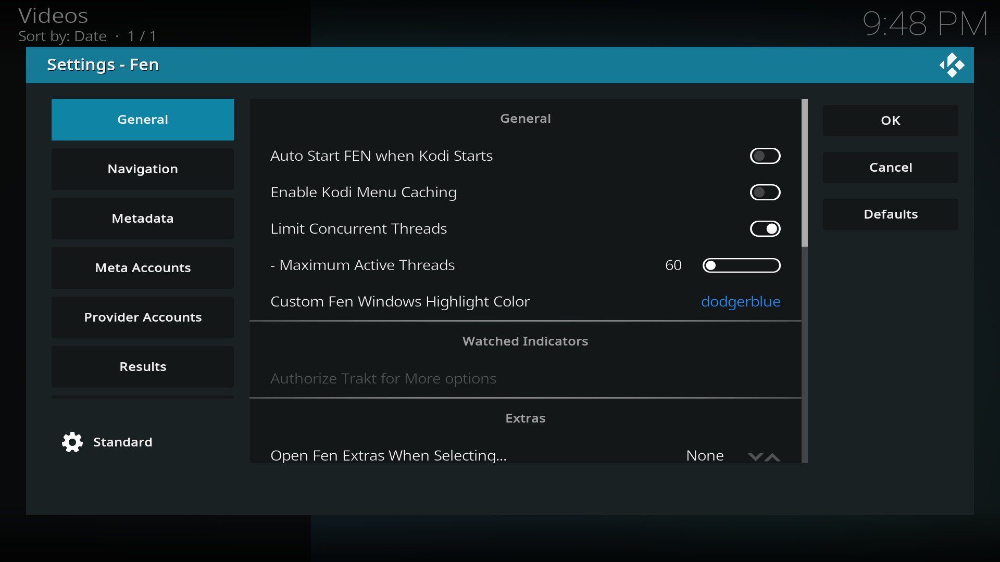
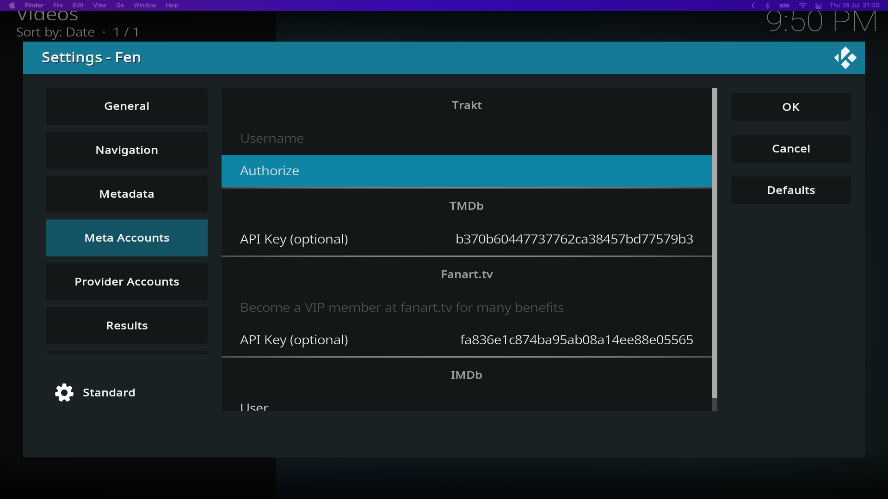

After installing Fen we can find it in the Add-ons section of the home page.

## Logging in to accounts

The next step is now connecting Fen to your accounts. Open Fen and navigate to `Settings` and then `SETTINGS: Fen`.

Here we can find all of Fen's settings! There are a lot of customization options in Fen and you'll be able to tailor your watching experience to your needs.

### Authorizing Trakt

We'll first login into Trakt by navigating to `Meta Accounts` on the left side and selecting `Authorize` under the Trakt section. 

A popup will appear with a code to authorize your account. In a web browser open [**https://trakt.tv/activate**](https://trakt.tv/activate), login with your Trakt credentials and input the code on the screen. 

After submitting a popup should appear in Kodi confirming that your authentication was successful.

#### Authorizing Real-Debrid

We will now do essentially the same process for Real-Debrid.



To do this, navigate to `Provider Accounts` in Fen settings, and select `Authorize` under the Real Debrid section.

Go to [**https://real-debrid.com/device**](https://real-debrid.com/device) and input the code that appears on your screen. After authentication, you can give the device a name to help better identify it on the Real-Debrid website.

On Kodi, a popup will appear to confirm that the authentication was successful.

## Fen Settings

While on the Fen Settings you can also go to `Metadata` and toggle `Enable Extra Art`. This will populate widgets and screens with art from the movies and shows.

If don't have a 4K display you might also want to limit the quality of sources to `1080p` to avoid downloading so much information. To do this go to `Playback` and select the qualities you'd like under `Limit Quality` for both `MOVIES` and `EPISODES`.

## Next steps

Fen is now configured and is already capable of streaming video. You can browse around in the Movies and TV Shows sections of the plugin and try it out for yourself!

There are a lot of options in Fen and I invite you to explore the settings page and see what works best for you.

In the next section, we will go over installing a custom skin and customizing Kodi so that it'll resemble the streaming service like experience you're accustomed to.

