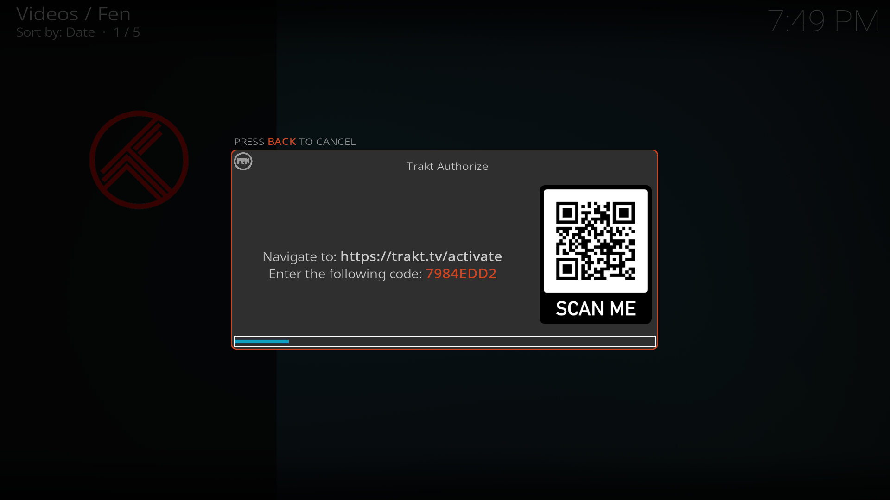

After installing Fen we can find it in the Add-ons section of the home page. You should also see the CocoScrapers module we installed. Select Fen to open the plugin.

## Authorizing accounts

Before we can start exploring any content we first need to setup some accounts. Inside Fen navigate to `Tools` and then `TOOLS: Accounts Manager`.

Here we can find some of the services that connect with Fen. In this guide we will be setting up Trakt and Real-Debrid.

### Authorizing Trakt

We'll start by authorizing Trakt. Select the `AUTHORIZE: Trakt` option and then select `Yes` to confirm.

A popup will appear with a code to authorize your account. You can navigate to [**https://trakt.tv/activate**](https://trakt.tv/activate) or scan the QR Code on screen.

In this Trakt page you will need to login with your Trakt credentials if you're not already, and input the code that you see on the screen.

After submitting a popup should appear in Kodi confirming that your authentication was successful. And you now see a `REVOKE AUTHORIZATION: Trakt` option, meaning that you are now authorized.

#### Authorizing Real-Debrid

We will now do essentially the same process for Real-Debrid.



To do this, select the `AUTHORIZE: Real Debrid` option, and select `Yes` to confirm.

Go to [**https://real-debrid.com/device**](https://real-debrid.com/device) or scan the QR Code and input the code that appears on your screen.

After authentication, you can give the device a name to help better identify it on the Real-Debrid website.

On Kodi, a popup will appear to confirm that the authentication was successful and you will again see the `REVOKE AUTHORIZATION: Real Debrid` option that confirms that you are now authorized.

## Selecting scrapers

Now that we have our accounts connected to Fen we can configure the scrapers. Scrapers are the modules that Fen uses to find content on the internet and the plugin that we installed earlier. For this guide we will use CocoScrapers.

Start by going to `Tools` and selecting `SETTINGS: Fen`. We write more about settings in the next section but for now in the left sidebar navigate to `Provider Accounts`.

Leave the sidebar by pressing the right button and inside the `External Scrapers` section select `Enable`. You will then see an option called `- Choose External Scrapers Module`, select this option.

A popup will appear with a list of options. Select `COCOSCRAPERS MODULE` and then press `OK`. Everything should now be correctly configured.



## Fen Settings

Fen has a lot of settings that you can configure to your liking, we recommend you explore them after you are more confortable with the plugin. For now you can use the default settings but there are some that we recommend you change.

<!-- While on the Fen Settings you can also go to `Metadata` and toggle `Enable Extra Art`. This will populate widgets and screens with art from the movies and shows. -->

If don't have a 4K display you might also want to limit the quality of sources to `1080p` to avoid seeing these types of files. To do this navigate to the `Playback` section of the settings and select the qualities you'd like under `Limit Quality` for both `Movies` and `Episodes`.

## Next steps

Fen is now configured and is already capable of streaming movies and shows! You can go back to the addon main page and browse around try it out for yourself!

In the next section, we will go over installing a custom skin and customizing Kodi so that it'll resemble a streaming service like experience and so that you don't have to navigate through the menus every time you want to watch something.

