For some parts of this explanation we'll assume you are more comfortable navigating in Kodi so we'll illustrate steps with fewer images and provide a more step-by-step approach for things we covered before like [adding repositories](/fen/installing-fen/#adding-a-repository) and [installing addons](/fen/installing-fen/#installing-an-addon).

## Installing the Arctic Zephyr 2

We'll start by installing a custom skin, an add-on that changes the look and feel of Kodi.



We'll start by adding a new repository, by going to `File Manager` → `Add source` and entering the following url:

```
https://heppenowski.github.io/repository.heppen
```

Give it a name like `heppen` and confirm.

Now in `Settings` → `Add-ons` → `Install from zip` install the `repository.heppen.zip` file found on the `heppen` source we just added.

After the installation is complete open the repository by going to `Settings` → `Addons` → `Install from repository` → `Heppen's Repository`.

Here navigate to `Look and feel` → `Skin` → `Arctic: Zephyr 2 - Resurrection` and `Install` the skin.

After installation, a popup will ask you if you'd like to switch to the installed skin, simply press `Yes`.

You can now see all of Kodi looks different. This means that the skin is successfully installed and in use. Your Kodi home screen should look something like this:

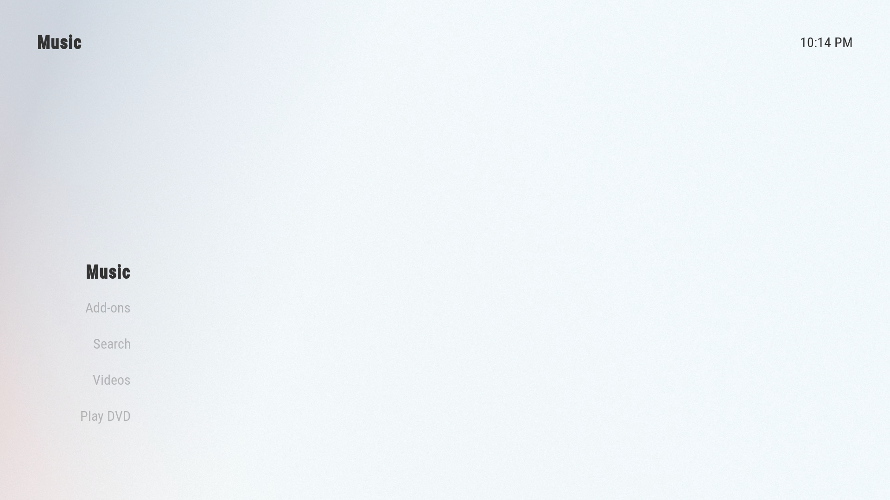

## Selecting the home layout

In this guide, we'll be using the `Flix View` layout but Arctic Zephyr 2 has a lot of other layouts you can try.

You can choose this by going to `Settings` → `Skin Settings` → `Home` → `Home layout` → `Flix View | Multiple widgets`.

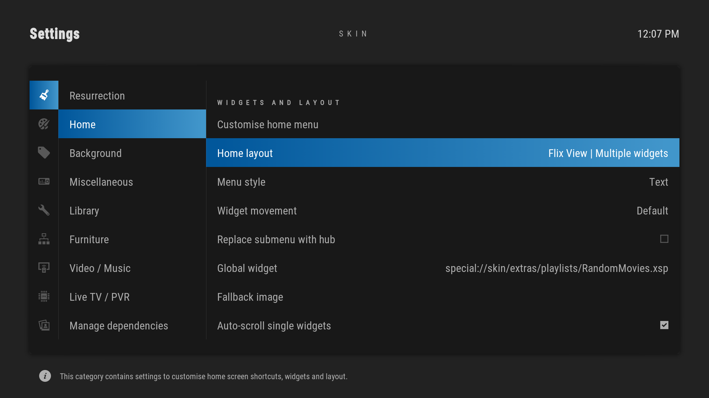

Now in the `Background` section on the left enable `Fanart` and **disable** `Blur background`.

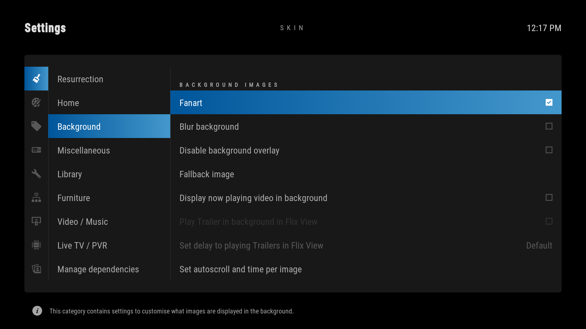

## Configuring the Main Menu

The main menu is the first thing you see when opening Kodi so we'll configure it to be more useful for our streaming purposes. We will map some of Fen's pages and functionalities to widgets on the main menu so they are easily accessible.

Open the main menu options by going to `Settings` → `Skin Settings` → `Home` → `Customise home menu`.

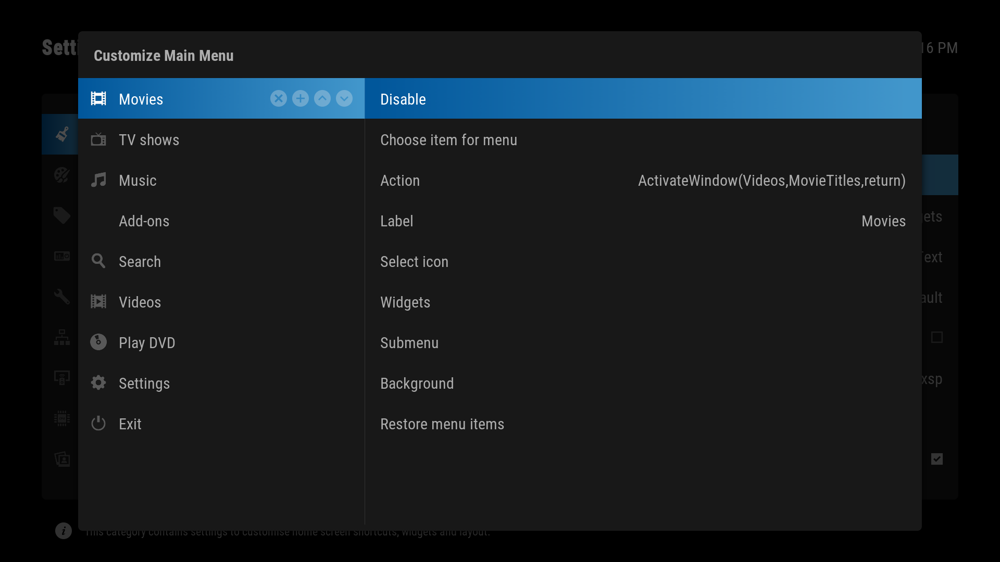

On the left, you'll see all your main menu items listed. We'll remove all the unnecessary ones and keep `TV Shows`, `Movies`, `Search`, `Settings` and `Exit` by clicking the `x` button when hovering over them.



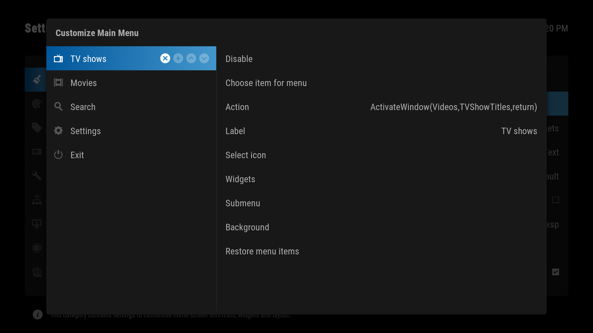

We'll now link the `TV Shows` shortcut to an `Action` in Fen. That way when we click on `TV Shows` Kodi will send us to Fen's `TV Shows` page.



With `TV Shows` highlighted on the left, go to `Action` → `Add-On` → `Video Add-on` → `Fen` → `TV Shows` → `Create menu item to here`.

#### Adding a widget

Next, we'll add a widget to the TV Shows section. This widget is just a list of items that will appear on the home page. We'll be adding a *Next Episodes* widget to quickly access the next episode to watch.

Inside the `TV Shows` shortcut navigate to `Widgets` to manage the page's widgets. Remove all the default views with the `✕` until you see `<None>`.

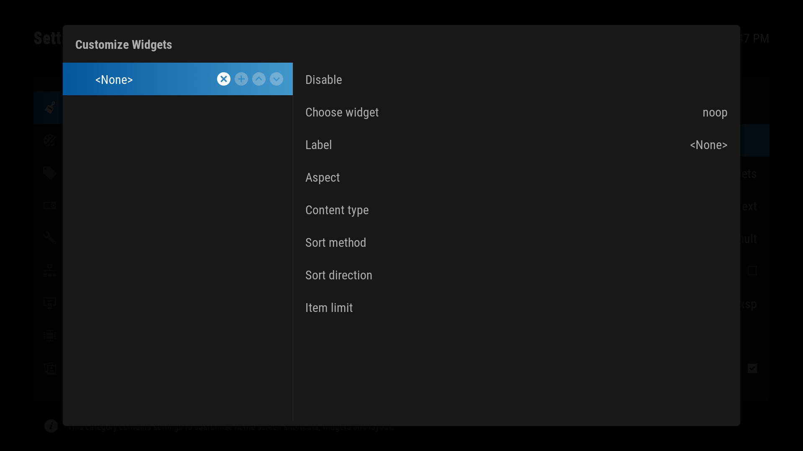

We'll now associate this blank widget with the `Next Episodes` section of the `Fen` plugin.

Go to `Choose widget` → `Add-On` → `Video Add-On` → `Fen` → `TV Shows` → `Next Episodes` → `Use as widget`. This will make the contents of that folder load in our widget.

Next, we'll choose what the widget looks like by selecting one of the `Aspect` options below. 

**Poster**


**Square**


**Landscape**


**Banner**
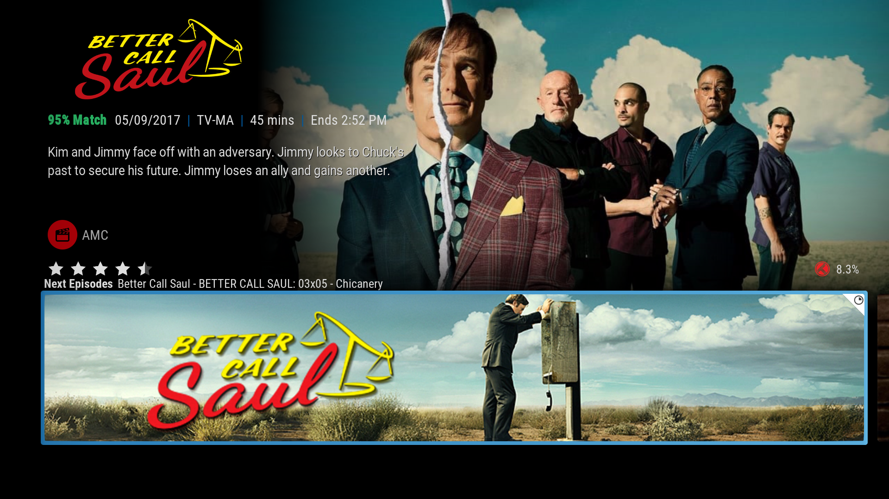

**Small Square**
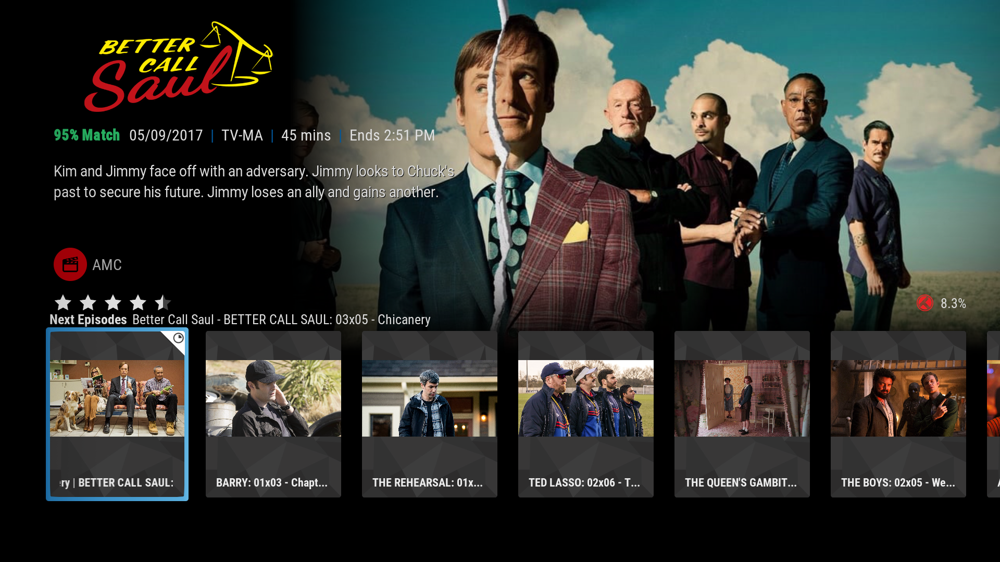

**Small Landscape**
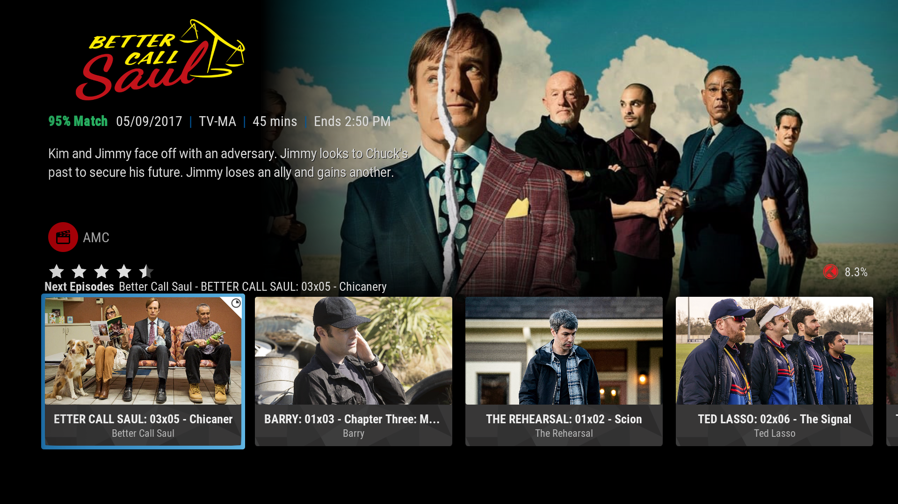

We'll be using the `Landscape` option.

Now we'll do the same for the `Movies` shortcut, we'll map its `Action` to the `Movies` page of Fen.

On the `Movies` subsection go to `Action` → `Add-On` → `Video Add-On` → `Fen` → `Movies` → `Create menu item to here`.

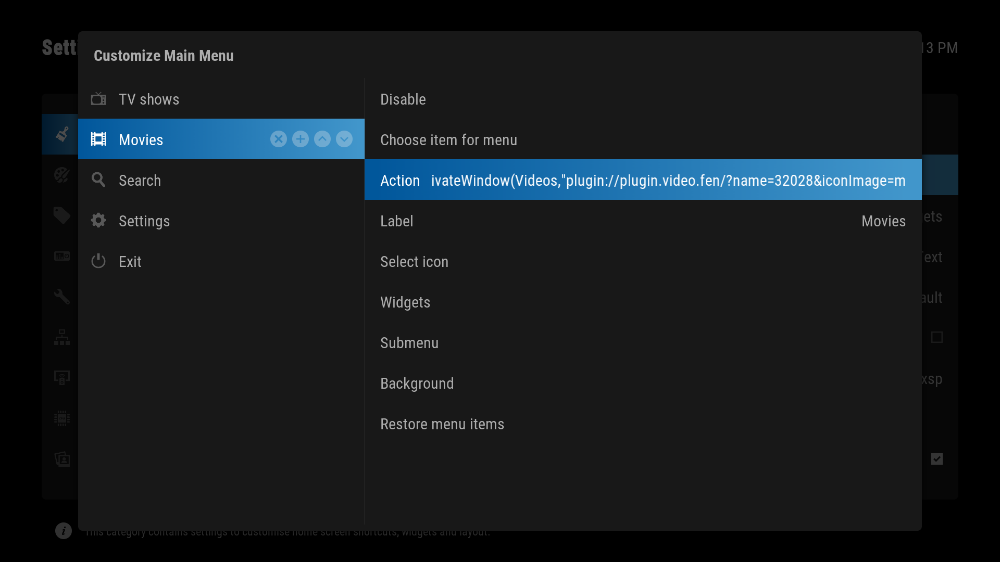

Let's now add some movie widgets to the home screen. For this setup, we're creating 3 different poster widgets but you can create as many or as few as you want.

In `Widgets` we'll add a widget for the *latest releases*. `Choose widget` → `Add-On` → `Video Add-On` → `Fen` → `Movies` → `Latest Releases` → `Use as widget`.

We'll also add a widget for your *Trakt Watchlist* that you can add movies to in a browser or app. `Choose widget` → `Add-On` → `Video Add-On` → `Fen` → `My Lists` → `TRAKT: Watchlist` → `TRAKT WATCHLIST: Movies` → `Use as widget`.

Finally an *In Progress* widget that will show you the movies you just couldn't finish in a seating. `Choose widget` → `Add-On` → `Video Add-On` → `Fen` → `Movies` → `In Progress` → `Use as widget`.

Don't forget to select the `Aspect` for each widget.

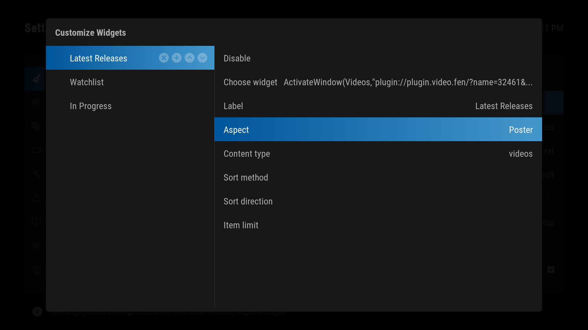

We'll finish by assigning an `Action` to the `Search` shortcut. This is where you'll go to search for something you want to watch.

In the `Search` shortcut go to `Action` → `Add-On` → `Video Add-On` → `Fen` → `Search` → `Create menu item to here`.

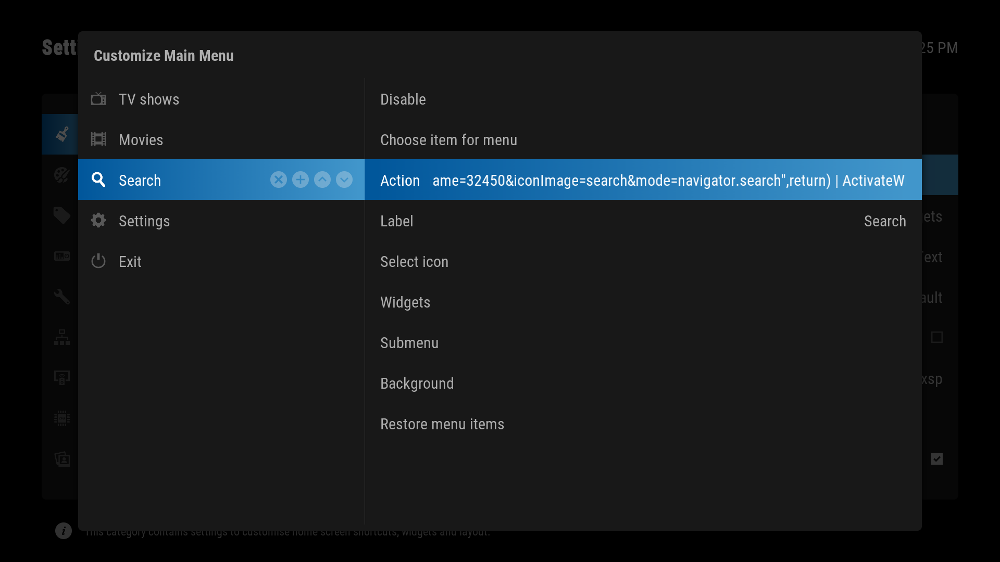

After returning to the home screen and waiting for the skin to load you'll see your new home screen.



**TV Shows**


**Movies**


**Search**
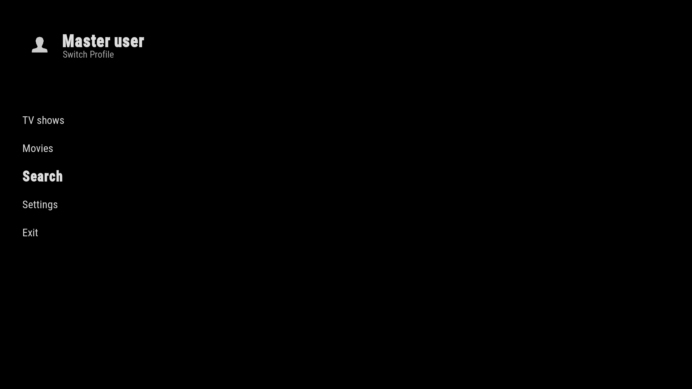
