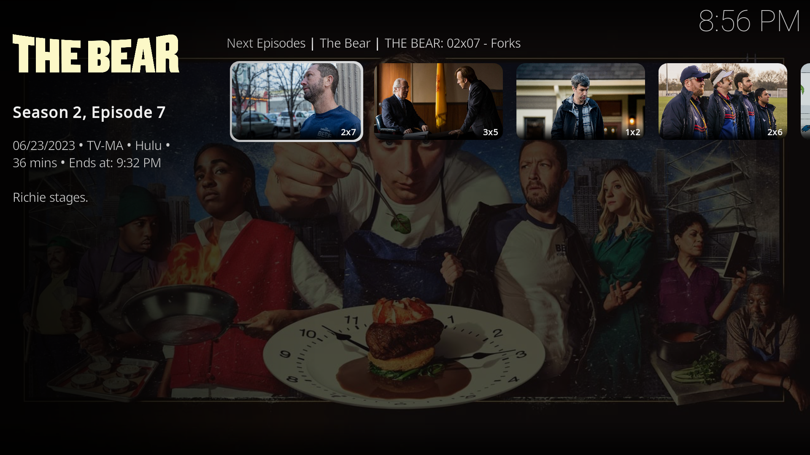
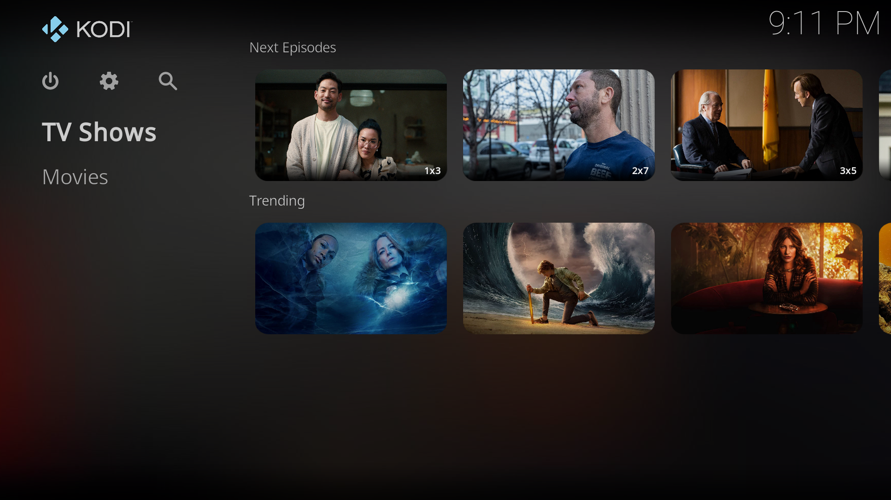
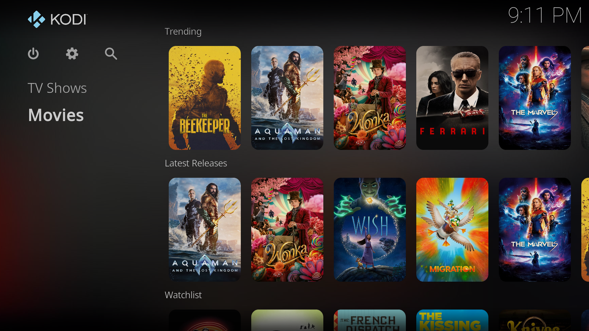

For some parts of this explanation we'll assume you are more comfortable navigating in Kodi so we'll illustrate steps with fewer images and provide a more step-by-step approach for things we covered before like [installing an addon from a repository](/fen/installing-fen/#installing-an-addon-from-a-repository).

## Installing FENtastic

We'll start by installing a custom skin, an add-on that changes the look and feel of Kodi.



We'll start by adding a new repository, by going to `File Manager` → `Add source` and entering the following url:

```
https://ivarbrandt.github.io/repository.ivarbrandt/
```

Give it a name like `repository.ivarbrandt` and confirm.

Now go to `Settings` → `Add-ons` → `Install from zip file` install the `repository.ivarbrandt-1.0.1.zip` file found on the `repository.ivarbrandt` source we just added.

After the installation is complete navigate to `Settings` → `Addons` → `Install from repository` → `ivarbrandt's Repository`.

Here navigate to `Look and feel` → `Skin` → `FENtastic` and `Install` the skin. Confirm any additional popups that appear and wait for the installation to complete.

After installation, a popup will ask you if you'd like to switch to the installed skin, simply press `Yes`. Another popup will appear asking you to keep the changes, press `Yes` again.

You can now see all of Kodi looks a bit different. This means that the skin is successfully installed and in use. Your Kodi home screen should now look something like this:


## Configuring FENtastic

When navigating to the `Settings` page you'll now see a new `Skin Settings` option. Here we can configure the skin to our liking.

### Configuring the Main Menu

The main menu is the first thing you see when opening Kodi so we'll configure it to be more useful for our streaming purposes. We will map some of Fen's pages and functionalities to widgets on the main menu so they are easily accessible.

In the `Main menu items section` of the `Skin Settings` you'll see something like this:


Start by navigating to the first instance where you see `- Set main menu path`. Here you will map this first menu item to the `TV Shows` page of Fen. Do this by selecting `- Set main menu path` → `Fen »` → `TV Shows »` → `Use TV Shows as path`. Set the label to be `TV Shows` as it should be by default.



Now for the second instance of `- Set main menu path` we'll map it to the `Movies` page of Fen. Do this by selecting `Fen »` → `Movies »` → `Use Movies as path`. Set the label to be `Movies`.

You can now deselect all the other items by pressing the toggles on the right for all other entries. This way only the `TV Shows` and `Movies` items will appear on your kodi main menu removing some clutter and making it easier to navigate.


### Adding widgets

Now that you only have the `TV Shows` and `Movies` options, we'll create some widgets.

A widget is just a list of items that will appear on the home page. That way instead of navigating in the Fen menus like we did before, content will automatically appear on your home screen every time you open Kodi.

#### TV Show widgets

We'll start by adding a **Next Episodes** widget to quickly access the next episode of a show you are watching. Under `TV Shows` select `- Set widgets` to manage that page's widgets. Here a popup will appear with a list of widgets you can add.


We'll now associate the first widget slot `Widget 1:` with the `Next Episodes` section of the `Fen` plugin.

We do this by selecting `Widget 1:` → `Fen »` → `TV Shows »` → `Next Episodes »` → `Use Next Episodes as path`. This will make the contents of that page within Fen load directly as a widget.

Next, a popup will appear for you to `Choose the widget display type`. This will change how the items of a widget look. You can choose between the following options:

**Poster**


**Big Poster**


**Landscape**


**Big Landscape**


**Landscape Info**


**Big Landscape Info**


We'll be using the `Big Landscape` option for TV Show widgets but you can choose the one that you like the most.



We will also add a **Trending** widget to see what shows are popular right now. Select `Widget 2:` → `Fen »` → `TV Shows »` → `Trending »` → `Use Trending as path`.

#### Movie widgets

Now we'll create some widgets for the `Movies` item. We'll add a **Trending**, **Latest releases** and **In Progress** widgets.

Start by navigating under `Movies` and select `- Set widgets` to manage movie widgets.

Select `Widget 1:` → `Fen »` → `Movies »` → `Trending »` → `Use Trending as path`. For movie we will use the `Big Poster` display type.

Next go to `Widget 2:` → `Fen »` → `Movies »` → `Latest Releases »` → `Use Latest Releases as path`.

Finally select `Widget 3:` → `Fen »` → `Movies »` → `In Progress »` → `Use In Progress as path`.

#### Trakt Watchlist

You can also add a widget for your **Trakt Watchlist** this way you can use the Trakt app on your phone to add movies you want to watch later and they will automatically appear in Kodi.

To add your movies watch list as a widget, select `Widget 4:` → `Fen »` → `My Lists »` → `TRAKT: Watchlist »` → `TRAKT WATCHLIST: Movies »` → `Use TRAKT WATCHLIST: Movies as path`.



As you can see you can customize the Kodi main menu to your liking and utilize Trakt features such as watchlists to make the experience more personalized to your tastes. These are just some examples of what you can create with widgets but we recommend you explore and create the best setup for you.

### Home screen example

When returning to the home screen you should now see the widgets you just added. If you followed all our steps your home screen should look something like this:

**TV Shows**


**Movies**




### Customizing search

Back in `Skin Settings` you will see a `Search` section. Here you can configure the behavior of the search icon that appears on the main menu.

We recommend that you uncheck every option except for `Movies` and `TV Shows`. This way when you search for something you will only see results from these categories.

You can also decide on the `Default home screen search icon behavior`. 
- If you want it to open a keyboard and go straight to search select the `Open keyboard` option.
- If you want it to show a list of your previous searches select the `Open search window` option.

To use the search feature simply press the magnifying glass icon on the top left of the home screen.


### IMDb and Rotten Tomatoes ratings

The `FENtastic` skin also allows you to show ratings from IMDb and Rotten Tomatoes next to movies and shows. To enable this functionality you have to provide it with a `MBdList API Key`.

You can get an API key by going to [**https://mdblist.com/preferences/**](https://mdblist.com/preferences/) and logging in with your Trakt account.

At the bottom of the page you will see a section called `API Access` and here you will have your unique API key.

In the `Skin Settings` navigate to the `Ratings/Trailers` select `Enter MDBList API Key` and enter the API key you just got from the MDBList website

You will now see some extra options appear. We recommend you only enable the `Rotten Tomatoes (Critic)`, `Rotten Tomatoes (Audience)` and `IMDb (Main)` and `IMDb (Popular)` options. This way you will only see the ratings from these sources and not have an overcrowded screen.

With this enabled your main menu will have rating information like the following examples:


