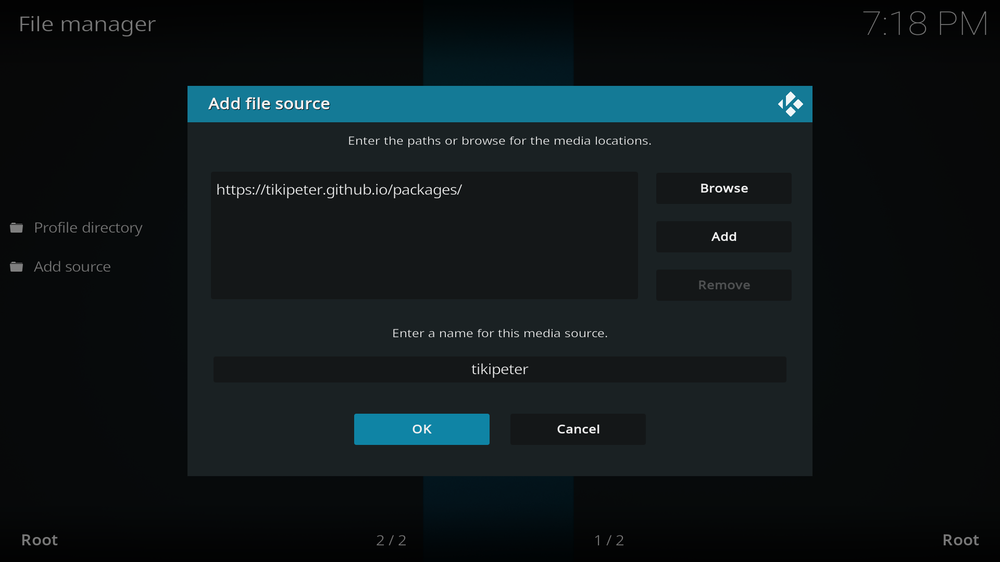
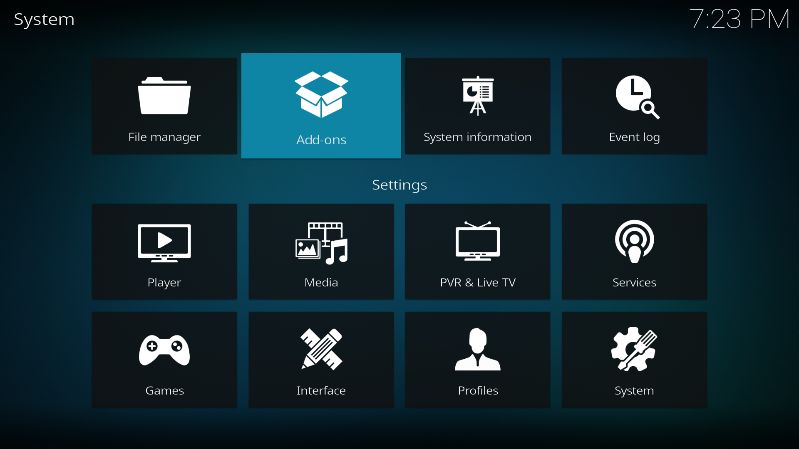
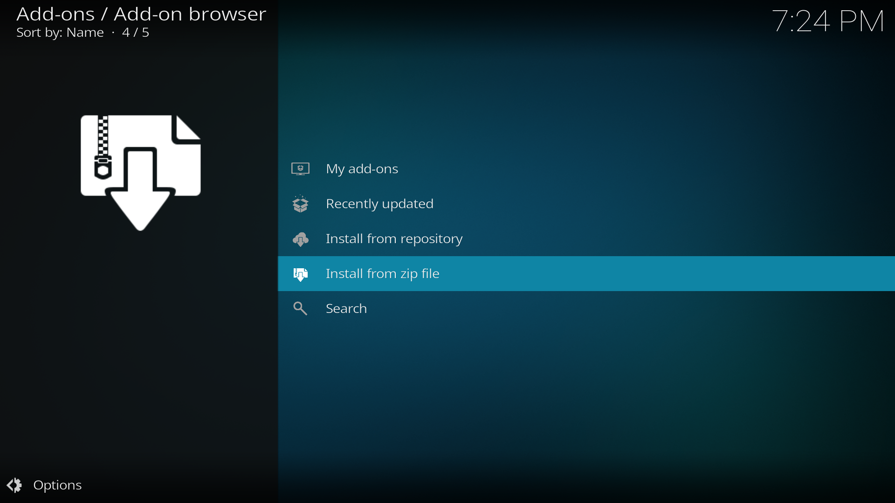

After you have installed Kodi and registered a [Real-Debrid](https://real-debrid.com/) and [Trakt](https://trakt.tv/auth/join) account we can start the installation process.

## Navigating in Kodi

Upon opening Kodi for the first time this should be the screen you're greeted to.


Kodi's navigation centres around four navigation keys, an **Enter** button and a **Back** button.




Navigate to the settings page via the gear button (⚙) on the start screen.


## Adding a repository

Fen is a custom plugin that expands Kodi's capabilities. To install plugins we need to tell Kodi a source to install them from. To do this we need to add a repository.

We start by going to the `File manager` section in settings and selecting `Add source`.


In the `Add file source` window that appears select the option `<None>`.


You'll see a textbox prompting you to input a source path. Here write the following url:

```
https://tikipeter.github.io/
```

After confirming, give the repository a name and press `OK`. We recommend you name it `tikipeter` as we will be referring to this name later in the guide.



Press `OK` and you will now see a `tikipeter` source in the `File manager` menu. This means the source has been added successfully.

Now we'll install the repository from this source. Go back to the main settings page and navigate to `Add-ons`.



Here select `Install from zip file`.



#### Enabling unknown sources

If this is the first addon you try to install you might see a security popup that warns you that `add-ons from unknown sources are disabled`.

To enable unknown sources simply select `Settings` and toggle the `Unknown sources` option in the system settings. This will prompt a warning you can accept.


With unknown sources active you can go back and proceed with the installation process with `Install from zip file`.

___

Here you'll see a list of all the available sources on your device. One of them will be the `tikipeter` source we added in the previous step.


Select it and install the `repository.tikipeter-1.0.0.zip` file found inside. After the repository is installed you will see an alert confirming the installation.


## Installing an addon

Now that the repository is installed we can finally install Fen. To do this, back in the `Addons` settings page select `Install from repository` and find the `Tikipeter's Repository`.

Inside navigate to `Video add-ons` and find `Fen`.


After selecting `Fen` you'll see the add-on details page where you can find a button to `Install`. Confirm any additional popups and wait for Fen to install.


You'll see a confirmation when it finishes installing.
