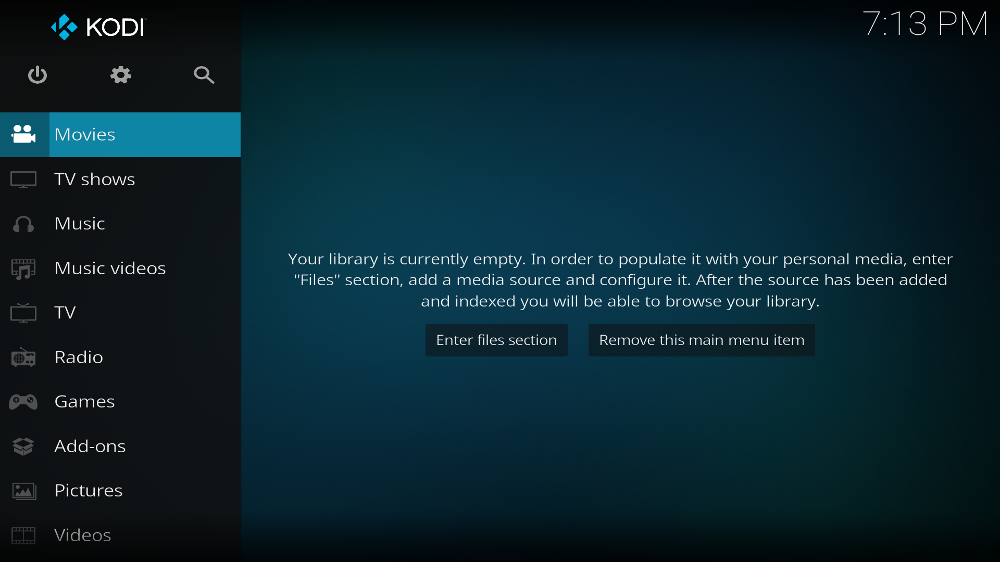
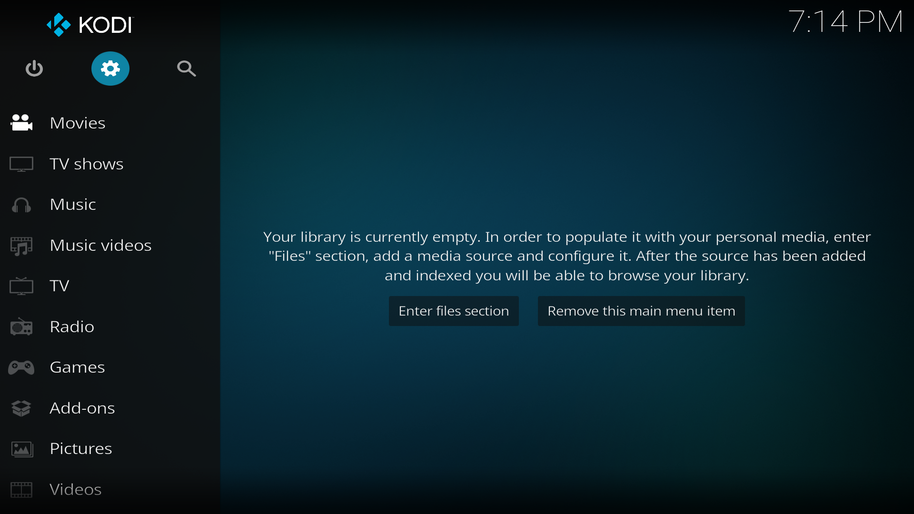
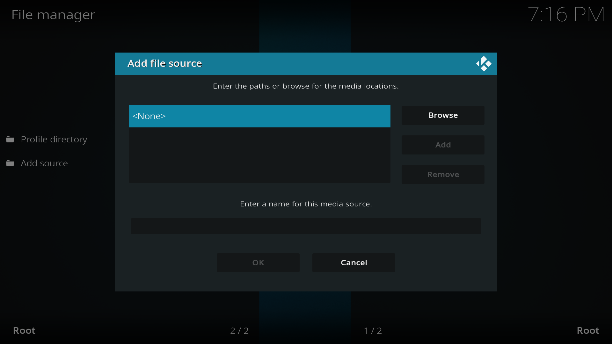
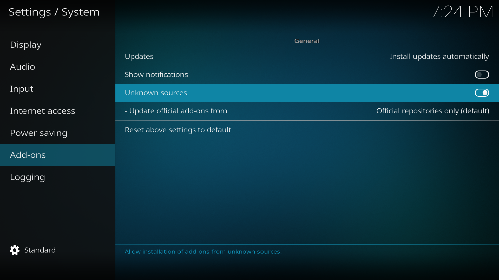

After you have installed Kodi and registered a [Real-Debrid](https://real-debrid.com/) and [Trakt](https://trakt.tv/auth/join) account we can start the installation process.

## Navigating in Kodi

When opening Kodi for the first time this should be the screen you're greeted to.



Kodi's navigation centres around four navigation keys, an **Enter** button and a **Back** button.





Navigate to the settings page via the gear button (⚙) on the start screen.


## Adding a file source

Fen is a custom plugin that expands Kodi's capabilities. To install plugins we need to tell Kodi a source to install them from.

We start by going to the `File manager` section in settings and selecting `Add source`.


In the `Add file source` window that appears select the option `<None>`.



You'll see a textbox prompting you to input a source path. Here write the following url:

```
https://tikipeter.github.io/packages/
```

After confirming, give the source a name and press `OK`. We recommend you name it `tikipeter` as we will be referring to this name later in the guide.


Press `OK` and you will now see a `tikipeter` source in the `File manager` menu. This means the source has been added successfully.

Another source you'll need to add is for CocoScrapers. Repeat the previous steps but this time add the following url and name it `cocojoe`:

```
https://cocojoe2411.github.io
```


Now we'll install the add-ons from these sources. Go back to the main settings page and navigate to `Add-ons`.


Here select `Install from zip file`.


___

#### Enabling unknown sources

If this is the first addon you try to install you might see a security popup that warns you that `add-ons from unknown sources are disabled`.

To enable unknown sources simply select `Settings` and toggle the `Unknown sources` option in the system settings. This will prompt a warning you can accept.



With unknown sources active you can go back and proceed with the installation process with `Install from zip file`.

___

Here you'll see a list of all the available sources on your device. You will see the `tikipeter` and `cocojoe` sources we added in the previous step.

First select `tikipeter` and install the `plugin.video.fen-3.x.xx.zip` file found inside.
After the instalation is complete you should see a `FEN FIRST USE` popup appear. You can press continue on all windows until the popup closes.


FEN is now installed but we still need to install the scrapers (as it's described in the popup you just closed). To do this navigate back to the `Install from zip file` screen and select the `cocojoe` and install the `repository.cocoscrapers-1.0.0.zip`. You'll see a confirmation when it finishes installing.

## Installing an addon from a repository

The Cocoscrapers instalation is different than Fen as you install it from a repository (that you just installed via a zip file). It seems convoluted but most Kodi addons are distributed this way to enable automatic updates. To install the addon itself we will need to navigate back to the `Addons` settings page select `Install from repository` where you will find our newly installed `CocoScrapers Repository`.

Inside navigate to `Program add-ons` and find `CocoScrapers Module`.


After selecting `CocoScrapers Module` you'll see the add-on details page where you can find an `Install` button on the bottom right.


Press install and wait for the instalation to complete. You are now ready to configure FEN.
