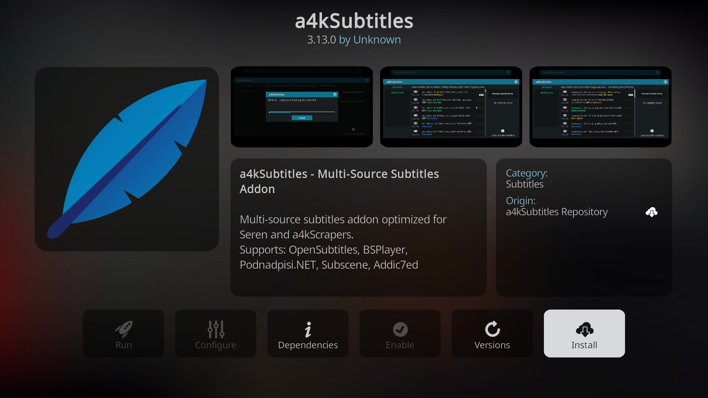
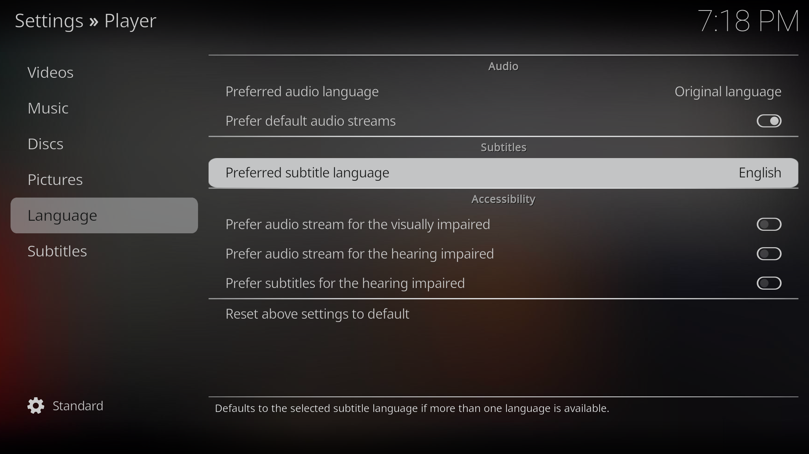
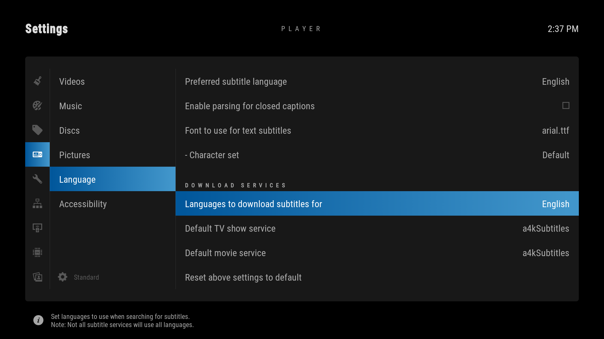
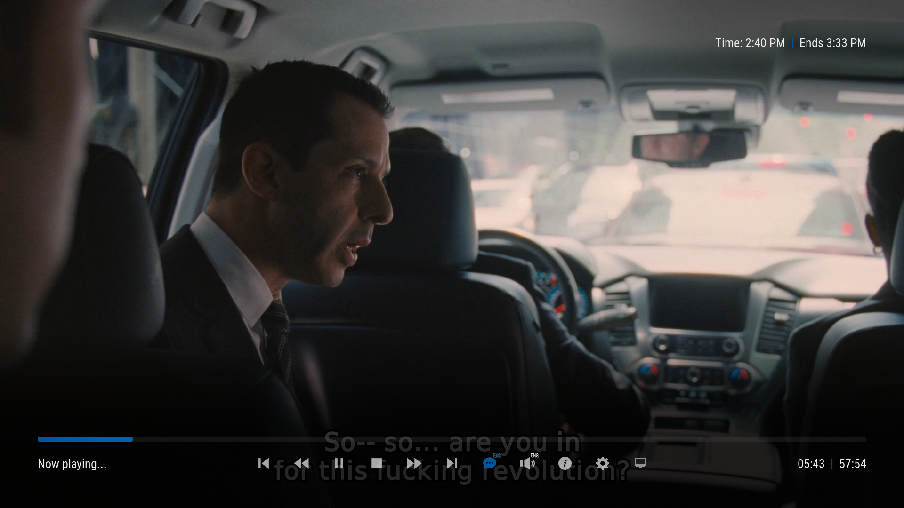
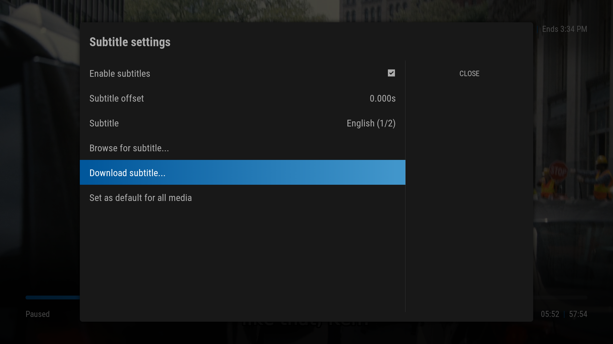
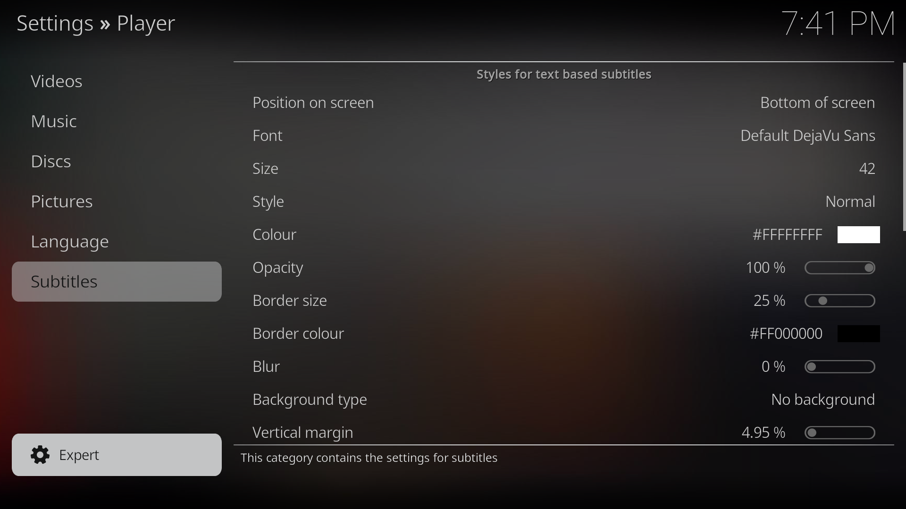
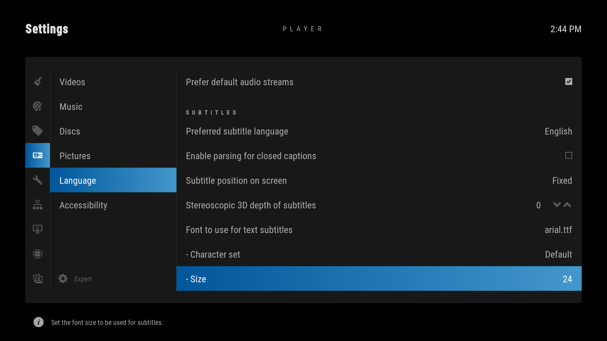

For people who want or need subtitles to enjoy media content, Kodi provides a very robust system to easily add subtitles to your files.

## Installing a4kSubtitles

a4kSubtitles is a simple add-on to download subtitles from various sources on the web. We'll use it to fetch subtitles for multiple languages or for files that don't have subtitles embedded in them.

Start by adding a new source in `File Manager` called `a4kSubtitles` with the following url:

```
https://a4k-openproject.github.io/a4kSubtitles/packages/
```

Next go to `Add-ons` → `Install from zip file` → `a4kSubtitles` → `a4kSubtitles-repository.zip` and install the repository.

Finally install the `a4kSubtitles` add-on by going to `Add-ons` → `Install from repository` → `a4kSubtitles Repository` → `Subtitles` → `a4kSubtitles` → `Install`.



## Configuring subtitles

After the installation, we'll need to tweak some Language settings. Navigate to `Settings` → `Player Settings` → `Language`. 

Here you can set your `Preferred subtitle language` which will force subtitles to appear by default if the file contains subtitles for that language.



In the download services section, you can select the `Languages to download subtitles for` and set `a4kSubtitles` as your `Default TV show service` and `Default movie service`.



## Selecting and downloading subtitles

After opening a stream you can access the playing menu by pressing your **Enter** button. Here you can find two toggles, one to toggle Audio tracks (🔊) and one to toggle Subtitles (💬).



For finer control, you can go to the Settings (⚙) menu and select `Subtitle Settings`. Here you can select the `Subtitle` currently displaying and download new subtitles by pressing `Download subtitle...`.





## Changing subtitle font size

If you want to change the subtitle font size you'll need to change to `Expert` settings on the bottom left of `Player settings` as seen below.



After you're in `Expert` mode go to `Language` → `Subtitles` and adjust the `Size`.

