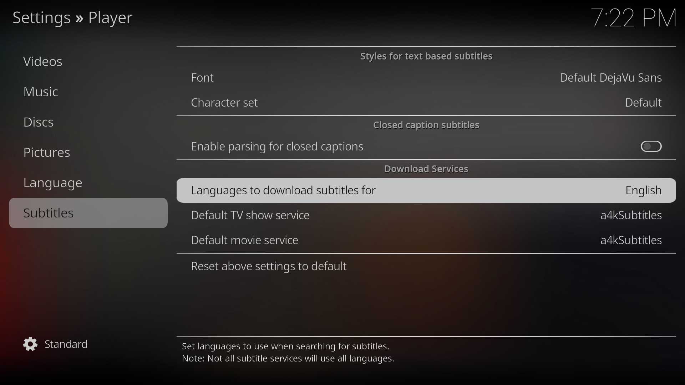

For people who want or need subtitles to enjoy media content, Kodi provides a very robust system to easily add subtitles to your files.

## Installing a4kSubtitles

a4kSubtitles is a simple add-on to download subtitles from various sources on the web. We'll use it to fetch subtitles for multiple languages or for files that don't have subtitles embedded in them.

Start by adding a new source in `File Manager` called `a4kSubtitles` with the following url:

```
https://a4k-openproject.github.io/a4kSubtitles/packages/
```

Next go to `Add-ons` → `Install from zip file` → `a4kSubtitles` → `a4kSubtitles-repository.zip` and install the repository.

Finally install the `a4kSubtitles` add-on by going to `Add-ons` → `Install from repository` → `a4kSubtitles Repository` → `Subtitles` → `a4kSubtitles` → `Install`.


### OpenSubtitles account

a4kSubtitles fetches subtitles from various sources online, one of the most popular sources is OpenSubtitles. To use OpenSubtitles you'll need to create an account on [their website](https://www.opensubtitles.org/) and input your credentials in the a4kSubtitles settings.

After installing a4kSubtitles, navigate to `Add-ons` → `My add-ons` → `Subtitles` → `a4kSubtitles` → `Configure` → `Accounts` and input your OpenSubtitles username and password.

## Configuring subtitles

After the installation, we'll need to tweak some Language settings. Navigate to `Settings` → `Player` → `Language`. 

Here you can set your `Preferred subtitle language` which will force subtitles to appear by default if the file contains subtitles for that language.


Next navigate to the next tab on the left called `Subtitles`, an inside the `Download Services` subsection select the `Languages to download subtitles for` and set `a4kSubtitles` as your `Default TV show service` and `Default movie service`.



You have now configured a4kSubtitles to download subtitles for your media files.

### Changing subtitle font size

If you want to change the subtitle font size you'll need to change to `Expert` mode on the bottom left in the `Player` section of the settings.


After doing this you can see a lot more options, including a `Size` option to change the subtitle font size.


## Selecting and downloading subtitles

Now that everything is set up, this is how you can select and download subtitles when watching a show or movie.

After opening a stream open the controls bar by pressing the **Enter** button. After it opens, navigate to the second to last icon on the right (💬). This icon opens the `Subtitle Settings`.


To view subtitles make sure the `Enable subtitles` toggle is on!

The `Subtitle` option will display the currently selected subtitle. If the file has no available subtitle or you want to find a new one select `Download subtitle...` and an a4kSubtitles window will appear.

You can also tweak subtitle timings in the `Subitlte offset` option. If the subtitles show up too early you can add a positive value to the offset, if they show up too late you can add a negative value.



