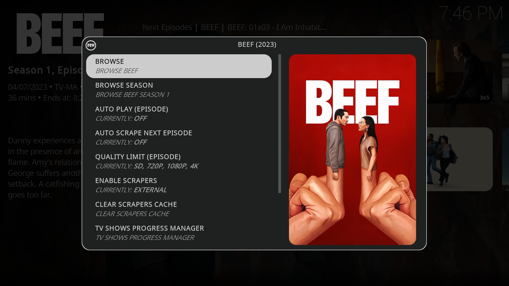
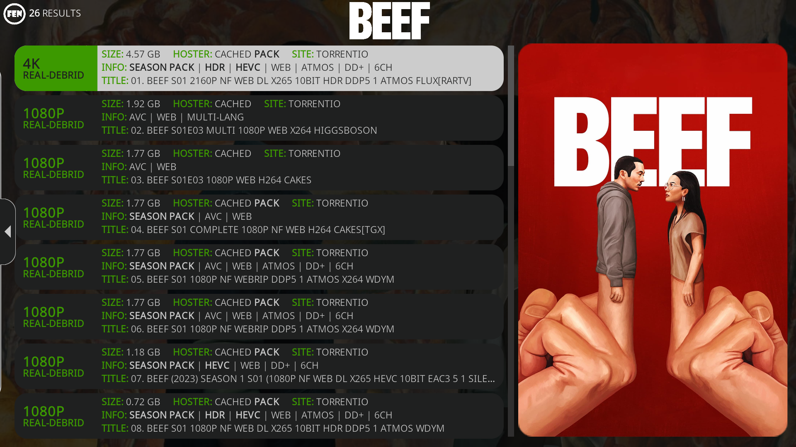
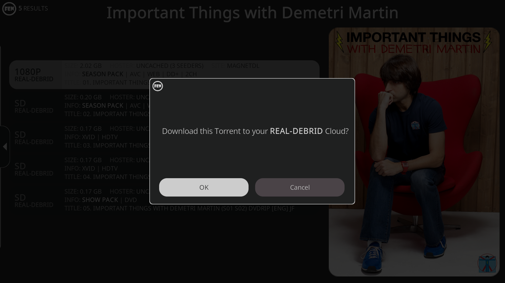

In this last chapter, we'll go over some tips on how to better use Fen. There's also a reference for all the Add-ons and sources used at the bottom of the page to be easier to find for more advanced users.

## Tips

### Item Options and Browse

You can access an item's options by long pressing on the item and selecting `Options...`. In this long press menu, you can also do some quick actions like marking the item as watched (`Mark Watched Trakt`) or refresh widgets.



In the options menu you can access all of a show's seasons by going to `BROWSE` or navigate through a season's episodes by going to `BROWSE SEASON`.

### Selecting sources

After the add-on scrapes all the available sources you are thrown into a selection screen.

There are several reasons to prefer different sources:

- If a source is stuttering or buffering during play select a source of a smaller `SIZE`.

- If a source doesn't have embedded subtitles you can try a different source that might have some. You can also try different sources to sync up to subtitles downloaded from `a4kSubtitles`.

- If you want to watch shows in their original language try to avoid sources that contain `MULTI` or a specific language like `ITA` or `RUS` in their names. These sources are usually dubbed for that specific language, although you can always change the audio track by going to `Audio Settings` in the controls bar when an item is playing.



### Adding sources

If an item doesn't have a source or the ones that exist are not good you can add new sources to your Real-debrid cloud. In the FEN Settings inside the `Results` tab you can toggle `Display Unchached Torrents`. This will show you all the torrents that are not cached by Real-debrid and are not available for streaming yet.

Now you can force a re-scrape by going to the item you were trying to play, long pressing and selecting`Options...` → `CLEAR SCRAPERS CACHE`. This will force a re-scrape and show you all the available sources again.

To add one to Real-debrid simply press on and select `OK` in the modal.



If the file has seeders it will be downloaded to your cloud and after a while (you can check the progress by going to [real-debrid.com/torrents](https://real-debrid.com/torrents)) you can re-scrape and start watching it.

## References

### Fen 

Fen is an add-on written and maintained by **tikipeter** found at:

```
https://tikipeter.github.io/packages/
```

### CocoScrapers

CocoScrapers is a plugin of scrapers found at:

```
https://cocojoe2411.github.io
```

### FENtastic

FENtastic is a modded Kodi skin based on the official Estuary Skin created and maintained by **ivarbrandt**. You can find it online [here](https://github.com/ivarbrandt/skin.fentastic) and you can install it via:
```
https://ivarbrandt.github.io/repository.ivarbrandt/
```

### a4kSubtitles

a4kSubtitles is a Kodi add-on created by the **a4k-openproject** to easily add subtitles to video files. You can install it via:
```
https://a4k-openproject.github.io/a4kSubtitles/packages/
```

## More information

You can read more about these addons and find the Kodi addon community where most of the information in this guide was gathered at [reddit.com/r/Addons4Kodi](https://www.reddit.com/r/Addons4Kodi/).

## Feedback

This guide is maintained anonymously by rugu.guru. You can reach out with feedback via email to [rugudotguru@gmail.com](mailto:rugudotguru@gmail.com).