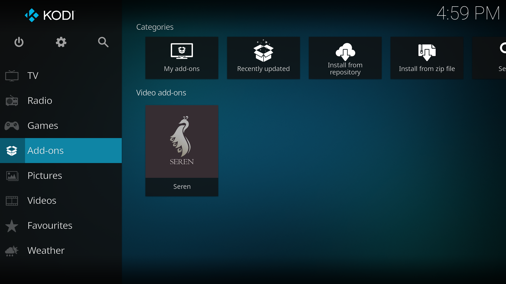
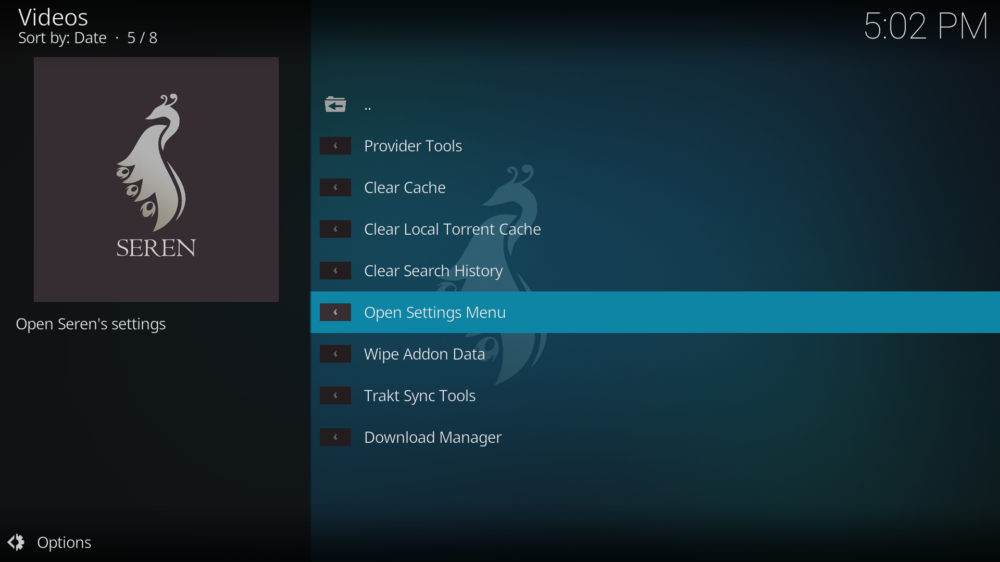
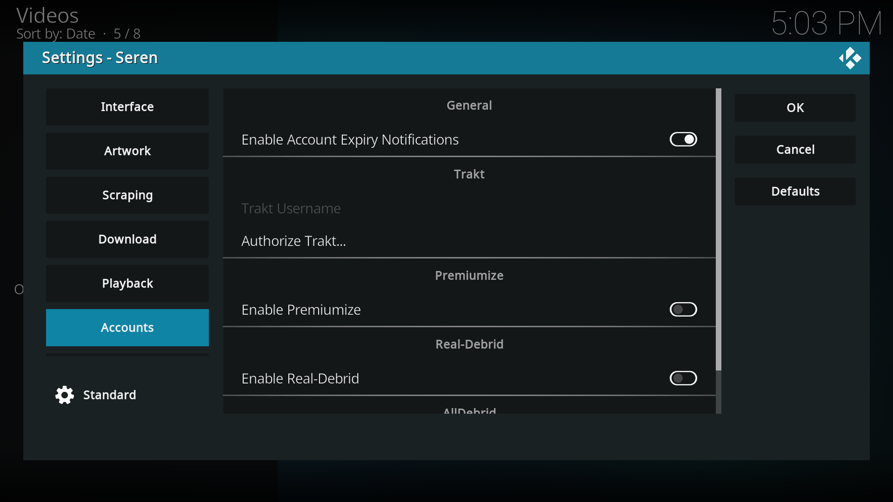
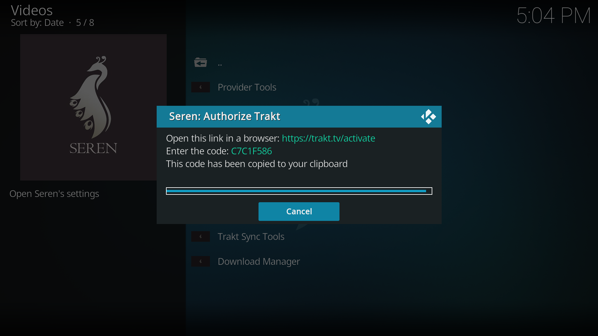
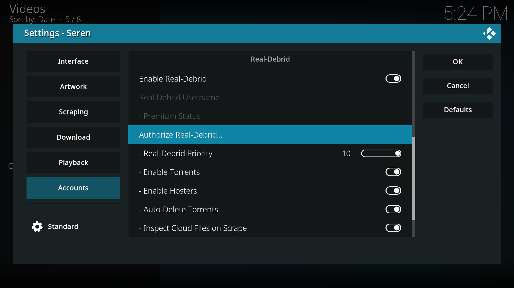
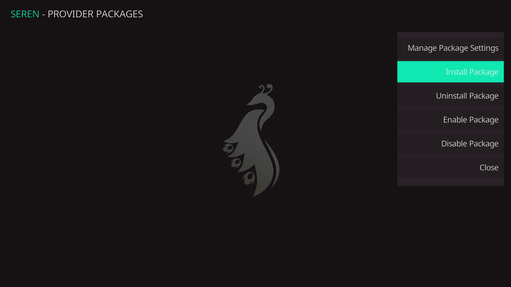
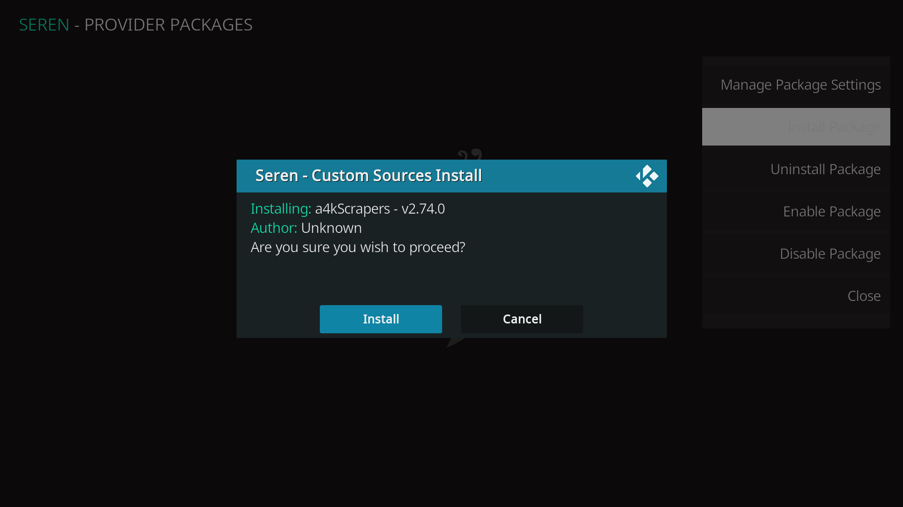

After installing Seren we can find it in the Add-ons section of the home page.



## Logging in to accounts

The first step is now connecting Seren to your accounts. Open Seren and navigate to settings by selecting `Tools` and `Open Settings Menu`.



In here we can find all of Seren's settings! There are a lot of customization options, and we'll cover some of them further ahead, but for now let's just continue by navigating to the `Accounts` option on the left.



#### Authorizing Trakt

We'll start by login in to Trakt by selecting `Authorize Trakt...`. A popup will appear guiding you on how to link the account.

In a web browser open [**https://trakt.tv/activate**](https://trakt.tv/activate), login with your Trakt credentials and input the code you see on your screen. 



After submitting a popup should appear in Kodi confirming that your authentication was successful.

#### Authorizing Real-Debrid

We will now do essentially the same process for Real-Debrid.



To do this, back in the `Accounts` section of the Seren settings, toggle `Enable Real-Debrid` and then select `Authorize Real-Debrid...`.



Go to [**https://real-debrid.com/device**](https://real-debrid.com/device) and input the code that appears on your screen. After authentication, you can give the device a name to help better identify it in the Real-Debrid website.

On Kodi a popup will appear to confirm authentication was successful.

## Adding providers

In order for Seren to find files for you to stream we're going to need some providers.

In the Seren `Tools` menu, navigate to `Provider Tools` → `Manage Provider Packages` and select the option `Install Package`.



In the modal that appears select `Web Location...` and input the following url:

```
https://bit.ly/a4kScrapers
```

A popup will appear to confirm the installation, simply press `Install` and you're done.



## Seren settings

Now we'll go over some of Seren's settings and our preferred setup, you can tweak these to your liking but I'll provide some justification for our choices. You can find the Seren settings by opening `Seren` and navigating to `Tools` → `Open Settings Menu`.

#### In Interface:

Set `Next Up Sort Style` to `Recently Watched`, this way your *Next Up* page will be sorted by the shows you are currently watching and not by the date of their release.

#### In Playback:

Set `Movie Play Style` and `Episode Play Style` to `Source Select`, this will allow you to select the file you want to play from a list of available sources instead of automatically choosing the first one. This way if you have a problem with a specific source you can easily try a new one.

#### In Sort & Filter:

Set `Max Resolution` to your device's maximum resolution. Since we don't have a 4K display ours is set to `1080p` in order to hide the 4K sources.

To confirm all your changes press the `OK` button on the right side of the screen and you're done!

## Next steps

Seren is now fully configured and you can already use it to watch movies and shows. In the next section will go over installing a custom skin and setting up Kodi in order to achieve a streaming service like experience.