After you have installed Kodi, and registered a [Real-Debrid](https://real-debrid.com/) and [Trakt](https://trakt.tv/auth/join) account we can start the installation process.

## Navigating in Kodi

After opening Kodi for the first time this should be the screen you're greeted to.

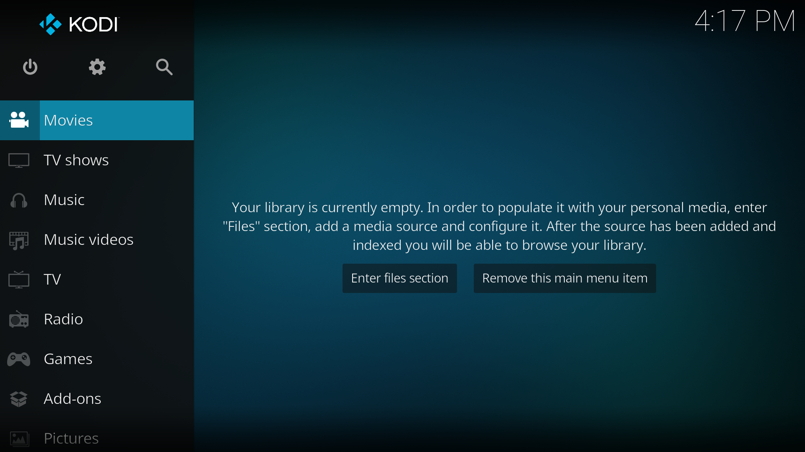

Kodi's navigation centers around four navigation keys, an **Enter** button and a **Back** button.



Navigate to the settings page via the gear button (⚙) on the start screen to begin the installation process.

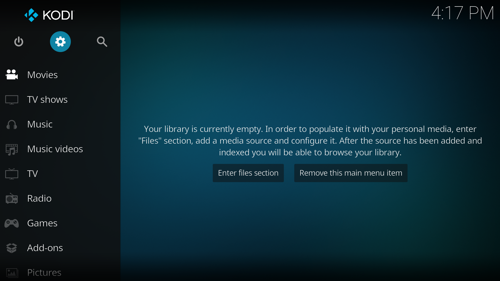

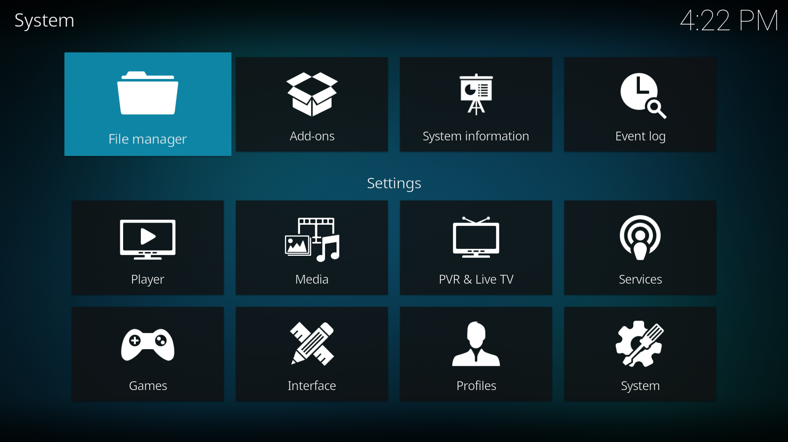


## Adding a repository

Seren is a custom plugin that expands Kodi's abilities. To install custom plugins we need to specify where they're information is fetched from. To do this in Kodi we need to add a repository.

To install a repository we first start by going to the `File manager` section in settings and selecting `Add source`.

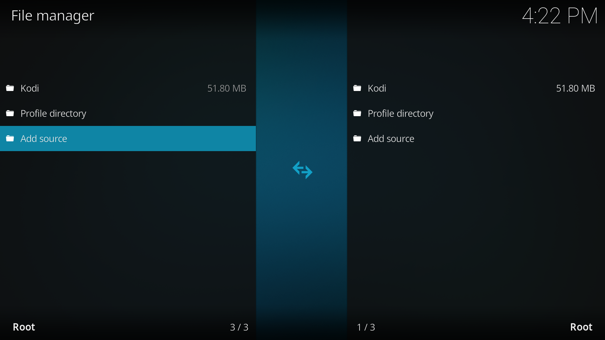

In the `Add file source` modal that appears below navigate to highlight the option `<None>`.

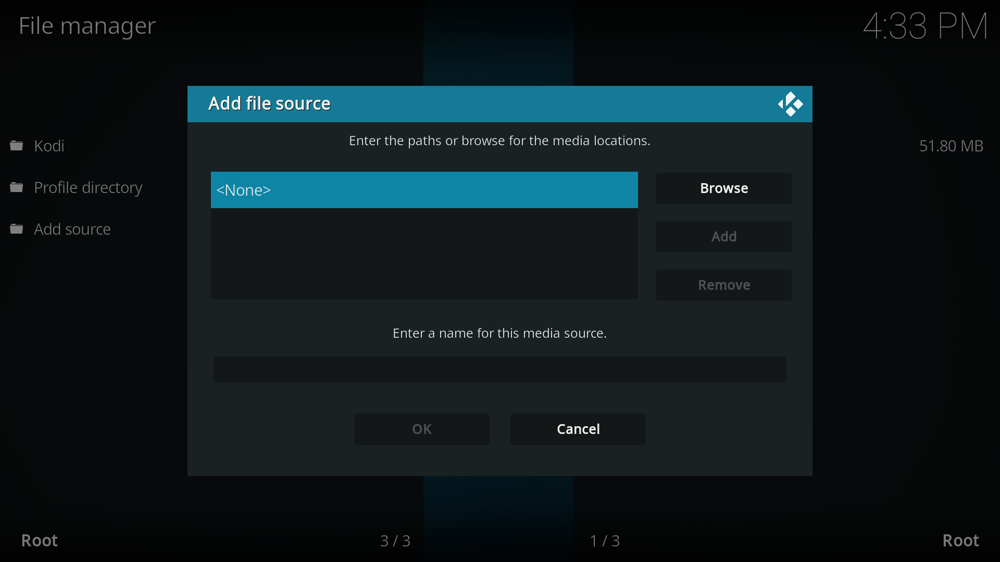

After selecting this option you'll see a textbox to input the source path. Here write the following url:

```
https://nixgates.github.io/packages/
```

After confirming, give the repository a name and press `OK`. We recommend you name it `Nixgates` as we will be referring to this name later in the guide.

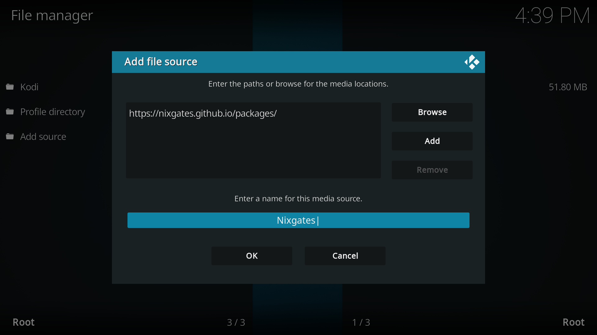

Press `OK` and you will now see a `Nixgates` source in the `File manager` menu. This means the source has been added successfully.

Now we'll install the repository from this source, go back to the main settings page and navigating to `Add-ons`.

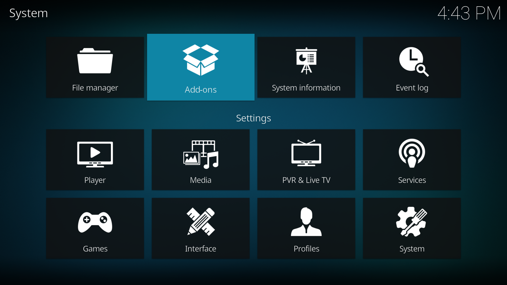

Here select `Install from zip file`.

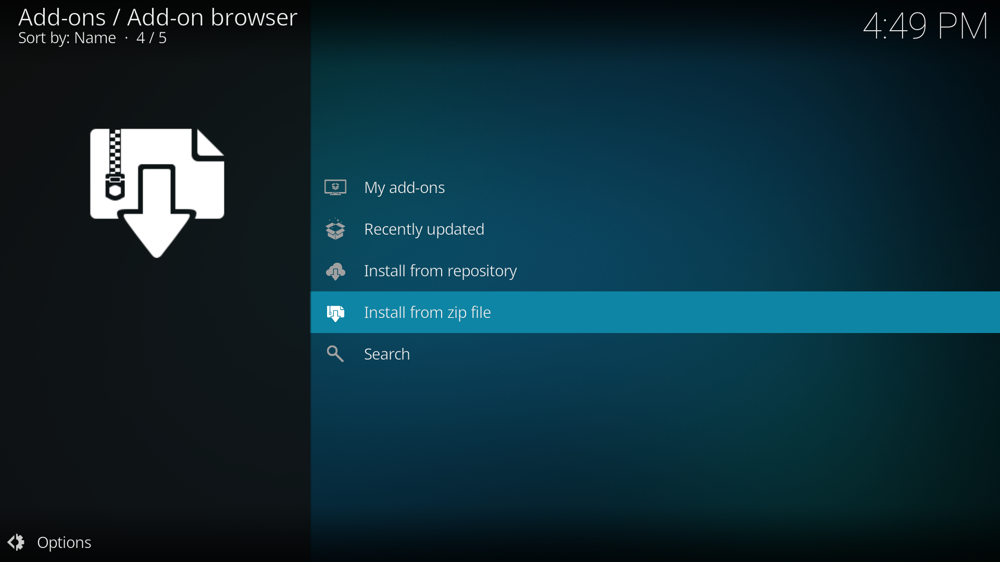

#### Enabling unknown sources

If this is the first addon you try to install you might see a security popup that warns you that `add-ons from unknown sources are disabled`.

To enable unknown sources simply select `Settings` and toggle the `Unknown sources` option it the system settings. This will prompt a warning you can accept.

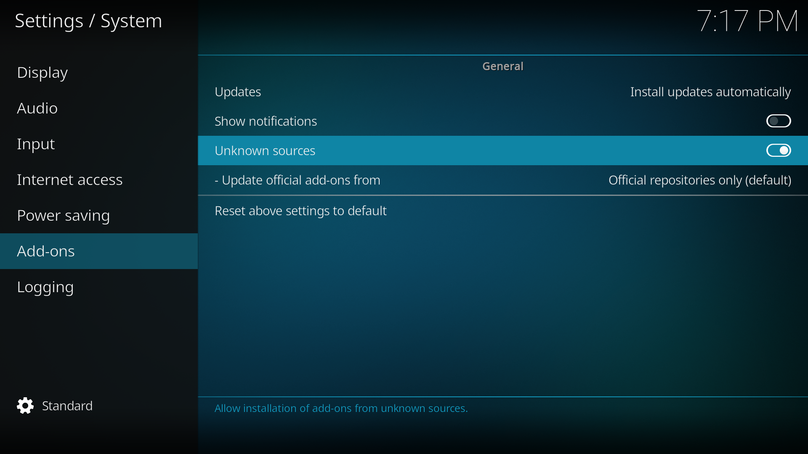

With unknown sources active you can go back and proceed with the installation process with `Install from zip file`.

___

Here you'll see a list of all the available sources in your device. One of them will be the `Nixgates` source we added in the previous step.

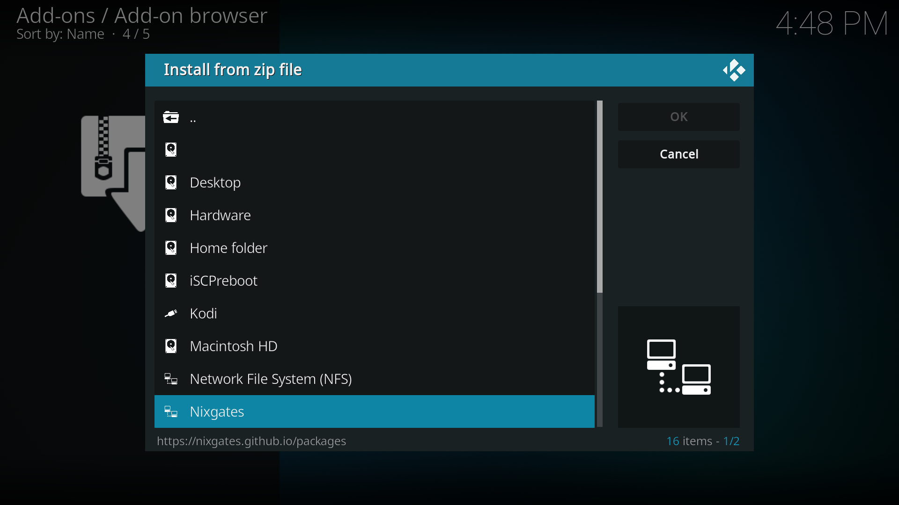

Select it and install the `repository.nixgates-2.*.*.zip` file found inside. After the repository is installed you will see an alert confirming the installation.

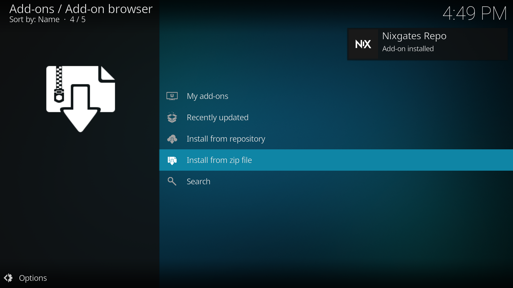

## Installing an addon

Now that the repository is installed we can finally install Seren. To do this, back in the `Addons` settings page select `Install from repository` and find the `Nixgates Repo`.

Inside navigate to `Video add-ons` and find `Seren`.

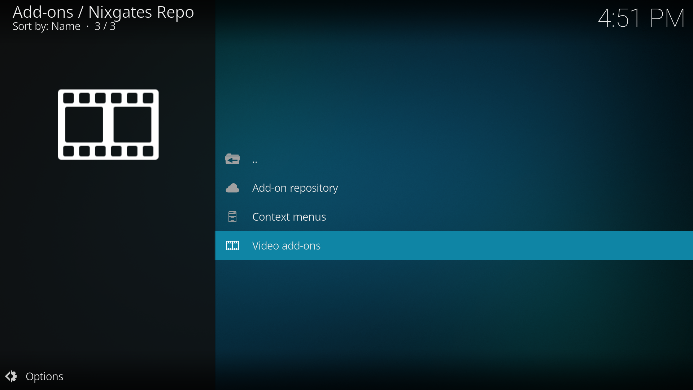

After selecting `Seren` you'll see the add-on details page where you can find a button to `Install`. Confirm any additional popups and wait for Seren to install.

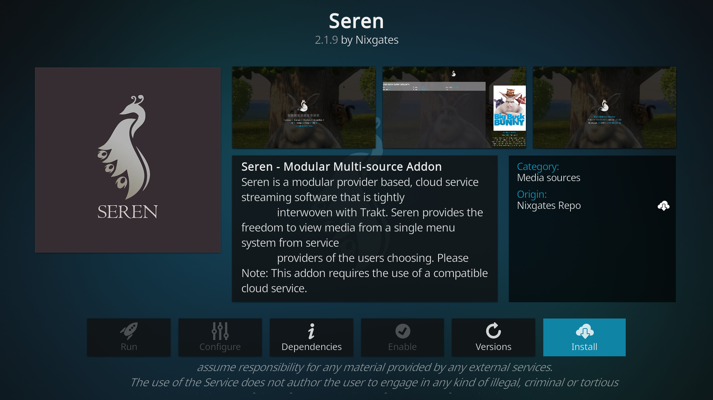

You'll see a confirmation when it finishes installing.
