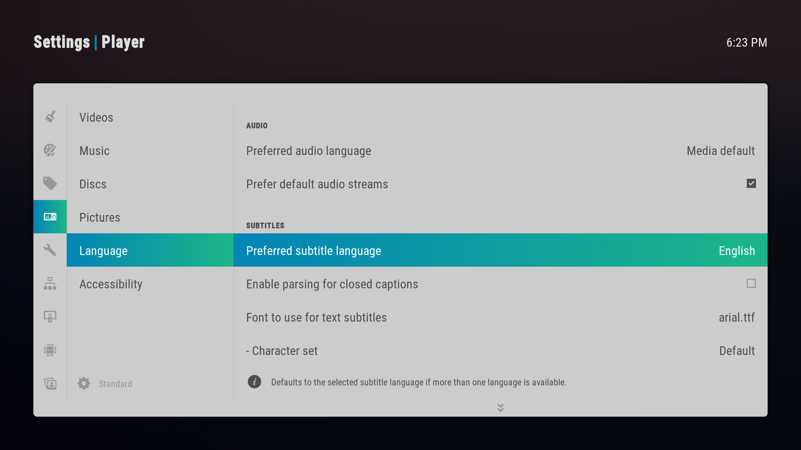
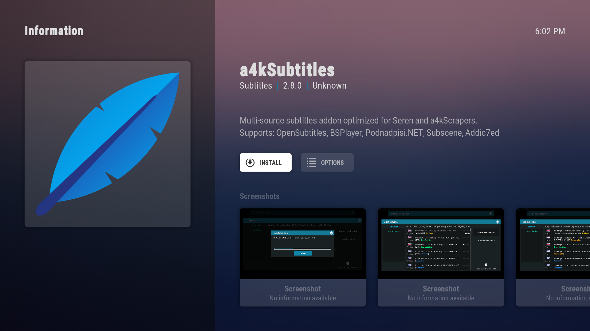
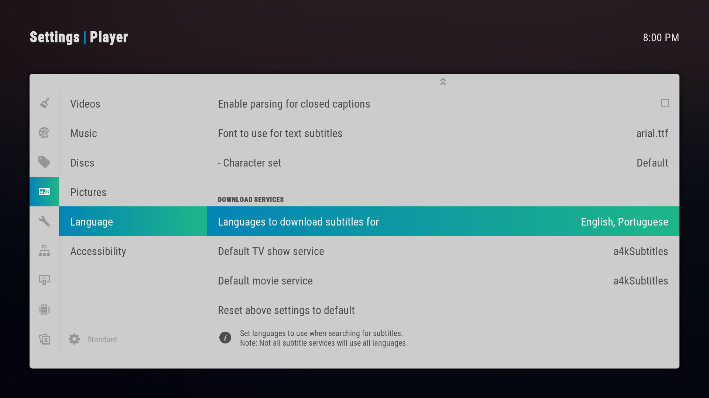
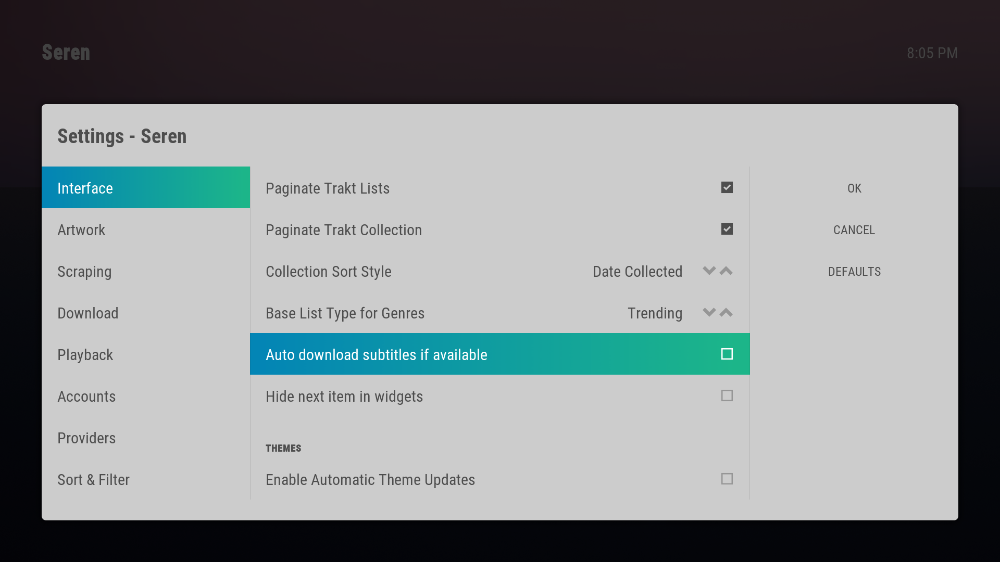
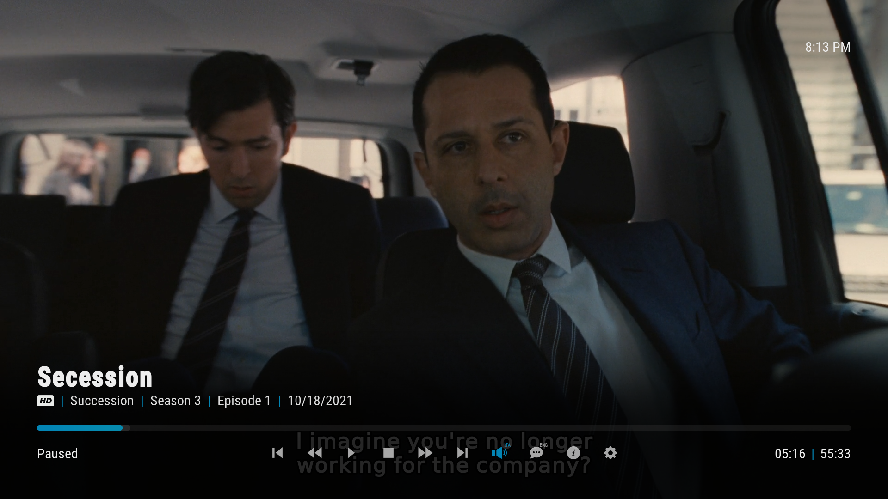
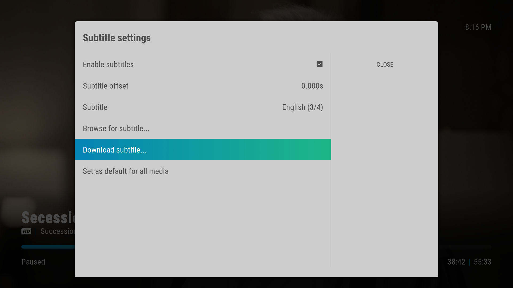
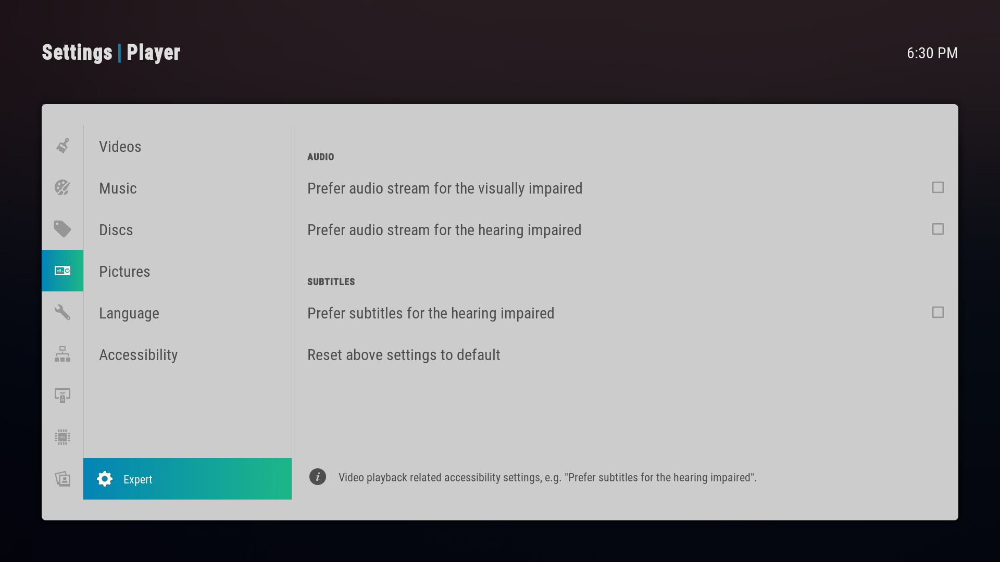
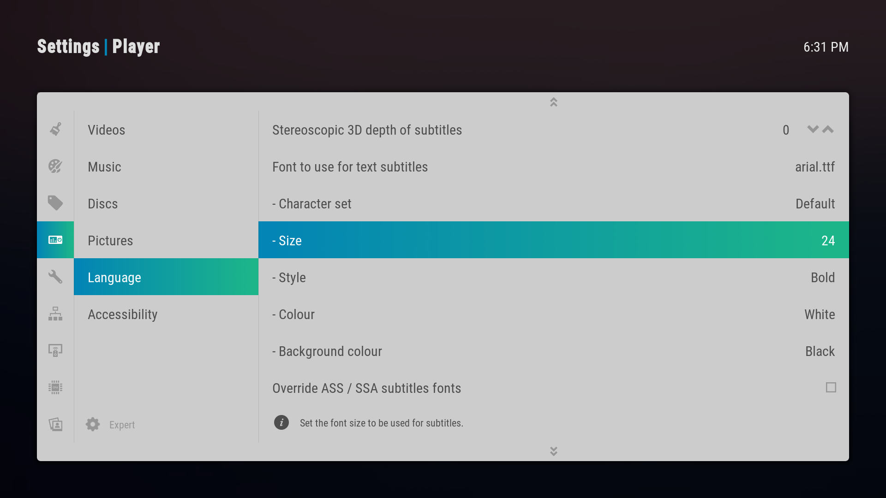

For people who want or need subtitles to enjoy media content, Kodi provides a very robust system to easily add subtitles to your files.

### Make subtitles appear by default

Subtitles don't appear by default in Kodi, in order to change this behavior go to `Player settings` → `Language` and simply select a language in `Preferred subtitle language` option. If a file playing contains a subtitle for the selected language, it will now be displayed automatically.



## Installing a4kSubtitles

a4kSubtitles is a simple add-on to download subtitles from various sources on the web. We'll use it to fetch subtitles for multiple languages or for files that don't have subtitles.

Start by adding a new source in `File Manager` called `a4kSubtitles` with the following url:

```
https://a4k-openproject.github.io/a4kSubtitles/packages/
```

Next go to `Add-ons` → `Install from zip file` → `a4kSubtitles` → `a4kSubtitles-repository.zip` and install the repository.

Finally install the `a4kSubtitles` add-on by going to `Add-ons` → `Install from repository` → `a4kSubtitles Repository` → `Subtitles` → `a4kSubtitles` → `Install`.



After the installation navigate back to `Player settings` → `Language` and set the `Languages to download subtitles for`. Here you can also set `a4kSubtitles` as your `Default TV show service` and `Default movie service`.



After this step Seren will automatically download subtitles for the selected language. 

Since this is an automated process, sometimes a wrong subtitle might be downloaded. If you only want **English** subtitles we advise you to disable automatic fetching as most files already come with the right english subtitles embed in.

To do this go to `Seren` → `Tools` → `Open Settings Menu` → `Interface` and un-toggle the `Auto download subtitles if available` option.



## Selecting and downloading subtitles

After opening a stream you can access the playing menu by pressing your **Enter** button. Here you can find two toggles, one to toggle Audio tracks (🔊) and one to toggle Subtitles (💬).





For finer control you can go to the Settings (⚙) menu and select `Subtitle Settings`. Here you can select the `Subtitle` currently displaying and download new subtitles by pressing `Download subtitle...`.



## Changing subtitle font size

If you want to change the subtitle font size you'll need to change to `Expert` settings on the bottom left of `Player settings` as seen below.



After you're in `Expert` mode go to `Language` → `Subtitles` and adjust the `Size`.

